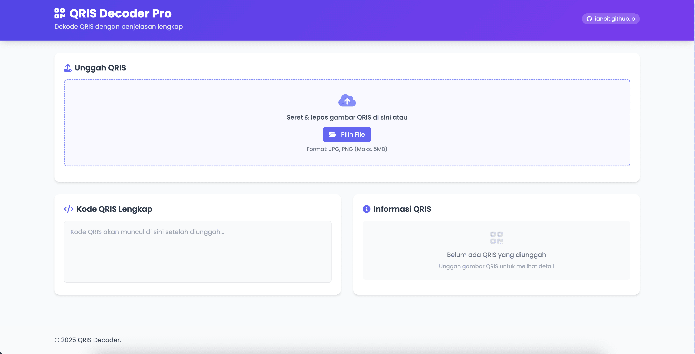
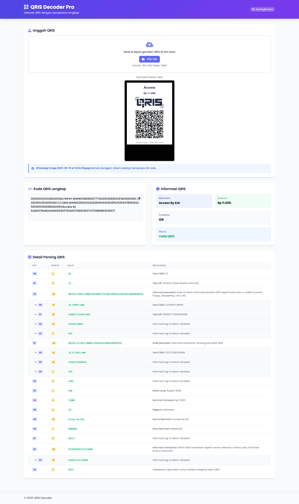

Aplikasi web berbasis HTML, JavaScript, dan OCR yang memungkinkan pengguna untuk mengunggah gambar QRIS (Quick Response Code Indonesian Standard), mengekstrak datanya, dan menampilkan penjelasan setiap bagian.

# Fitur Utama
1. Upload Gambar QRIS  
Pengguna dapat mengunggah gambar berisi kode QRIS dari struk atau layar.

1. Otomatis Membaca QR Code  
Menggunakan OCR dan decoding untuk mengambil konten QRIS dari gambar.

1. Penjelasan Isi QRIS
Setiap bagian dari kode QRIS dijelaskan seperti ID Merchant, Nama Usaha, Nominal, dan lain-lain.

# Cara Menggunakan  
1. Clone repositori ini:

    ```bash
    git clone https://github.com/username/nama-repo.git
    cd nama-repo
    ```

1. Buka index.html di browser:  

    - Tidak memerlukan server.  
    - Bisa langsung dibuka secara lokal.

1. Upload gambar QRIS (misalnya dari struk pembayaran).

1. Aplikasi akan:  
    - Menampilkan kode mentah dari QRIS.
    - Menampilkan penjelasan tiap bagian dalam format yang mudah dibaca.

# Screenshot

